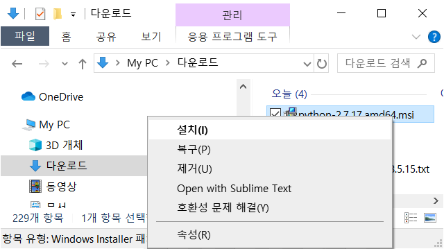
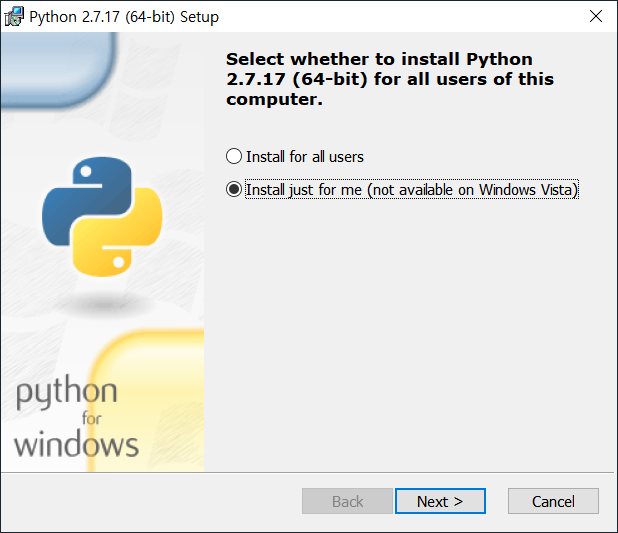
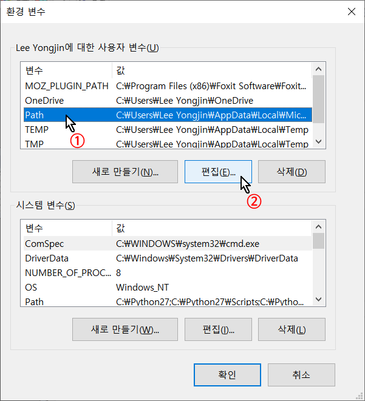
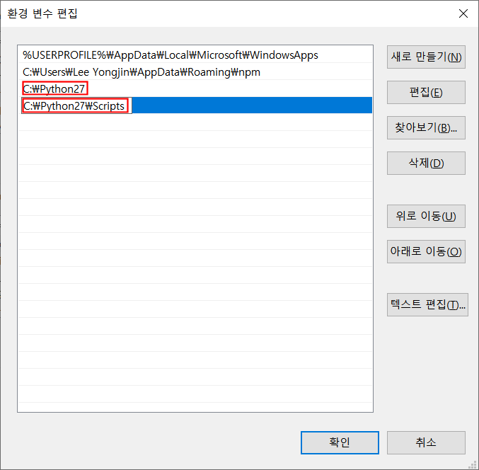
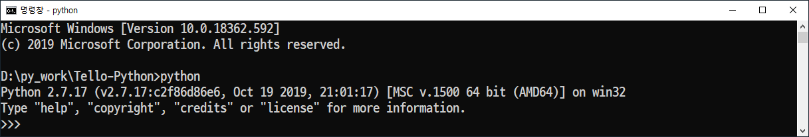
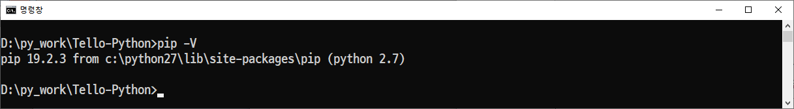

## Tello-Python 예제 실행을 위한 윈도우10 설정

64비트 윈도우10 환경에서 **Tello-Python** 예제를 동작시키기 위한 개발환경 설정


### 1. Python 2.7.17 설치

------

Single_Tello_Test **[** v **]**     Tello_Video **[** v **]**     Tello_Video_With_Pose_Recognition **[** v **]** 

------

버전 2.7.17 은 2020년 2월 현재 2.7.x 버전 중 가장 최신 버전이며, PIP( 파이썬 패키지 관리자 )가 함께 설치된다. 2.7.15 이전 버전의 경우 pip 를 따로 설치해야 하며, 그 설치에 어려움을 겪을 수도 있다. 

- 다음 링크를 클릭하여 설치파일( 64비트 윈도우용 설치파일 )을 다운로드 한다.

   <https://www.python.org/ftp/python/2.7.17/python-2.7.17.amd64.msi>

* 파일 탐색기에서 다운로드한 설치파일을 마우스 오른쪽 버튼 클릭으로 선택한 후  **설치(I)** 를 선택한다.



* **'Install just for me (...)'** 를 선택한 후, **Next >** 버튼을 클릭한다.

  

* 이 후에 나타나는 선택창은 기본값으로 진행하여 설치를 마친다.


### 2. Python 2.7 사용을 위한 윈도우 환경변수 설정

------

Single_Tello_Test **[** v **]**     Tello_Video **[** v **]**     Tello_Video_With_Pose_Recognition **[** v **]** 

------

* 내 PC 의 속성을 연 후 **고급 시스템** 설정을 클릭한다. 

   

* 환경변수 설정 팝업 창에서 **'사용자 변수(U)'** 항목 중 **'Path'** 를 선택 후, **'편집(E)'** 을 클릭하여 환경 변수 편집창을 연다. 

* 환경 변수 편집 팝업창에서 **'새로만들기(N)'** 버튼을 클릭 후, **파이썬 2.7** 의 경로( `C:\Python27` )를 입력한다. 

* 같은 방법으로 **PIP** 가 설치되어 있는 경로( `C:\Python27\Scripts` )도 추가한다. 

  ( 앞서 파이썬 설치과정에서 **'Install just for me (...)'** 옵션을 선택했으므로 **'시스템 변수(U)'** 는 변경할 필요가 없다. )
  
        

* 변경된 사용자 환경변수 반영을 위해 로그아웃 후 다시 로그인 한다.

* 재로그인 후 명령창에서 `python` 을 실행 후 아래와 같은 결과를 확인한다.

  

  확인 후에는 `exit()` 를 입력하거나 `Ctrl + Z` 를 입력하여 종료한다.

* pip 설치 확인을 위해 `pip -V` 실행 후 다음과 같은 결과를 확인한다.

  

  이제 pip를 이용하여 라이브러리를 설치할 수 있다.


### 3. Python 라이브러리 설치

------

Single_Tello_Test **[**    **]**     Tello_Video **[** v **]**     Tello_Video_With_Pose_Recognition **[** v **]** 

------

* **numpy** 설치

  ```
  python -m pip install numpy
  ```

- **matplotlib** 설치

  ```
  python -m pip install matplotlib
  ```

- **opencv-python** 설치

  ```
  python -m pip install -v opencv-python==3.4.2.17
  ```

- **pillow** 설치

  ```
  python -m pip install pillow
  ```


### 4. 추가 의존성 설치

------

Single_Tello_Test **[**    **]**     Tello_Video **[** v **]**     Tello_Video_With_Pose_Recognition **[** v **]** 

------

#### 4.1 libboost-python

libboost-python 는 파이썬에서 C++ API를 쉽고 빠르게 사용할 수 있는 방법을 제공한다.

* 다음 링크를 클릭하여 64비트 윈도우용 설치파일을 다운로드한다. 

  <https://sourceforge.net/projects/boost/files/boost-binaries/1.68.0/boost_1_68_0-msvc-12.0-64.exe/download>

* 다운로드한 파일을 관리자 권한으로 설치한다.

* libboost 가 설치된 폴더( 설치 옵션 변경없이 설치했다면 `C:\Local\boost_1_68_0` ) 의 하위 폴더 중 `lib64-msvc-12.0` 폴더에서 `boost_python27-vc120-mt-x64-1_68.dll` 파일을  `C:\Python27\Lib\site-packages` 로 복사한다. 

   

#### 4.2 ffmpeg

ffmepeg 은 매우 빠른 속도로 비디오/오디오 스트림을 기록, 변환할 수 있는 오픈소스 프로그램 패키지이다. Tello 카메라 영상 스트리밍을 디코딩하기 위한 python h264 decoder 에서 바로 ffmpeg을 이용한다. 

* 웹브라우저에서 URL https://ffmpeg.zeranoe.com/builds/ 를 열고, 아래 그림과 같이 Version, Architecture,  Linking 을 각 4.2.2, Windows 64-bit, Shared 를 선택한 후 Download Build 를 클릭한다. 

  

* 다운로드한 파일의 압축을 해제하면 bin, doc, presets 폴더와 LICENSE.txt, README.txt 파일이 나오는데, bin  폴더 내부의 모든 dll 파일을 `C:\Python27\Lib\site-packages` 폴더로 복사한다. 

#### 4.3 Python h264 decoder

h264 형식으로 인코딩된 Tello 의 카메라 영상 스트리밍을 디코딩하기 위한 프로그램


### 5. Pose 인식을 위한 weight 파일 설치

------

Single_Tello_Test **[**    **]**     Tello_Video **[**    **]**     Tello_Video_With_Pose_Recognition **[** v **]** 

------

 Tello_Video_With_Pose_Recognition 예제는 Tello 카메라 앞에서 사람이 취한 자세( pose )를 인식하여, 3가지의 pose 에 대해 드론이 전진 / 후진 / 착륙 동작을 하도록 만들어진 예제이다. 

자세( pose ) 인식을 위해 'openpose' 라는 라이브러리를 사용하며, Tello_Video_With_Pose_Recognition 폴더의  `models` 폴더에 관련 파일들이 들어 있다. 

그 중  `Tello_Video_With_Pose_Recognition\models\pose\mpi` 폴더에 `pose_deploy_linevec.prototxt` 파일( pose 인식을 위한 weight 파일 )이 없으므로, 이 파일을 설치하기 위해 `models` 폴더의 `install.bat` 파일을 실행한다.


**openpose** 

- 웹페이지

​	<https://www.learnopencv.com/deep-learning-based-human-pose-estimation-using-opencv-cpp-python/>

- github

​	<https://github.com/CMU-Perceptual-Computing-Lab/openpose>

* 참고자료( 한국어 )

​	<https://blog.naver.com/rhrkdfus/221531159811>


